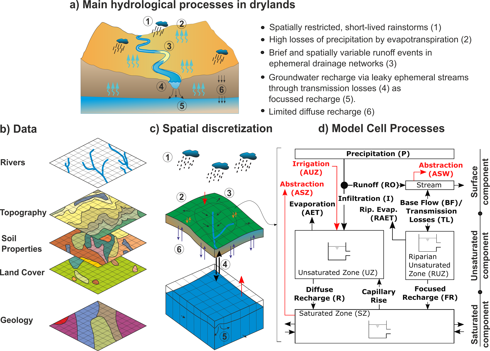

.. _dryp_model:

======================================
DRYP: Dryland Water Partitioning model
======================================

Model description and structure
--------------------------------

The parsimounius water partitioning model is a process-based distributed hydrological model.

Model Hydrological Parameters
^^^^^^^^^^^^^^^^^^^^^^^^^^^^^

The model uses as input parameter files spatially distributed maps in raster format. If parameter file is not provided, the model will use spatially uniform default values.

A list of parameters required for each component is presented below:

For the **surface component**:

* Digital elevation model (DEM), required (essential).
* River network length (in meters) (values greater than zero are specified as rivers), if not available all cells are considered rivers. Default values is the size of model grids.
* Flow direction in landlab format (ID of receiving node following landlab indexing), if no available, Landlab will automatically find the direction of flow based on the digital elevation model (DEM).
* Model domain, a raster file that can indicating the basin. Default value is 1.0. If not provided, the entire grid will be assumed as the model domain.
* Channel witdth (in meters), default value is 10m.

In case of proving a flow direction file, it should follow Landlab conventions. A comprehensive description of landlab flow direction convention can be found `here <https://landlab.readthedocs.io/en/master/reference/components/flow_director.html>`_. Noted that Landlab grids are labelled from 0 to n, where n is the number of cells (see `here <https://landlab.readthedocs.io/en/master/user_guide/grid.html>`_ and example below).

.. parsed-literal::
    ncols        5
    nrows        4
    xllcorner    574361
    yllcorner    3502989
    cellsize     1000
    NODATA_value  -9999
    15 16 17 18 19
    10 11 12 13 14
    5 6 7 8 9
    0 1 2 3 4

Flow direction raster files must have as values the number of the next downstream cell. If a cell value of the flow direction file has the same value of index, it means that it is a sink point.

For the **subsurface component** the following parameters can be provided, if not availble default values will be used:

* Rooting depth in mm, default value 1000mm
* path_uz_theta_wp, default value 0.1
* total available water wilting point (AWC), default value 0.10
* Porosity (n_e), default value 0.40
* Standard deviation of the saturated hydraulic conductivity, $\sigma$
* Infiltration at saturated conditions, ($K_{sat}$) in mm/h, default value 1.0 mm/h
* Water content at residual capacity, $\theta_r$
* Exponent of the water retention function (soil particle distribution), $b$ default value 10.5.
* Suction head, $\psi$, default value 300mm

For the **groundwater component**

* factor_sz_kksat, $Ks_{GW}$, default value 1 [m/h]
* Aquifer specific yield, $Ks_{GW}$, default value 0.01 [-]
* Groundwater model domain, optional, in case that groundwater catchment is different than surface catchment.
* Initial water table, default value is specified at 1 meter below the rooting depth.
* Head boundary conditions (optional)
* Flux boundary conditions (optional)
* Streambed elevation, default value is 5m below the surface elevation.

Forcing datasets
^^^^^^^^^^^^^^^^^

DRYP requires time series as model forcing datasets. Precipitation and potential evpotranspiration must be provided
in order to run the model, otherwise it will throw an error. Dataset can be spatially variable data
as netCDF files, or uniform values over the whole model domain by providing a csv file.

Model outputs
^^^^^^^^^^^^^^

Output variables for each model component are summarised below, the name of the variable is in brackets.
Units of time depends on model settings, for example months.

**Surface component**:

* Runoff (run), in mm/month
* Infiltration rate (inf, in mm/month)
* Transmission losses (tls), m3/month
* Streamflow (dis), m3/month
* surface water storage, it includes rivers (ssz), m3/month

**Subsurface and riparian component**:

* Soil and riparian Water content (tht), m3/m3
* Actual evapotranspiration from hillslope and riparian area (aet), mm/month
* Groundwater diffuse (drh) and focused (fch) recharge, mm/month

**Groundwater component**:

* Water table elevation (wte), m.
* groundwater discharge (gdh), m3/month
* capillary evapotranspiration (egw), mm/month
* total water storage deviation (twsc), m/month

.. _dryp_parameters:

Model parameters and setting files
-----------------------------------

Model input files are json, which can be created by using a text editor like notepad or code editor like Visual Studio Code.

Input parameter file
^^^^^^^^^^^^^^^^^^^^^

All filename's parameters must be listed in model parameters file, which is further explained below, However,
if a parameter filename is not provided, the default values will be used as model parameters.

The model is under development therefore some components are still not available (e.g. abstractions and 
irrigation are not yet available).

Meteorological data required as forcing dataset must be provided. Information can be provided in netCDF format
in order to take into account the spatial variability, or it can be a ".csv" file which in turn will assume a uniform rate
over the entire model domain (not common). Filenames of the forcing datasets should follow the format specified
in the paramter setting file (see next section), and it will depend on the numbers of files provided. If there
is only one file, the name of the file can be written directly on the files, but if there are multiple files it
will depend on the frequency. Yearly files must have the month and the year specified as numbers
(e.g. IMERG_2000-02.nc), whereas
yearly files must have only the year specified in numbers (e.g. IMERG-2000.nc). In the input parameter
file, the filename field must contain *YYYY* and/or *MM* for monthly or yearly datas, as it is shon in the
the following examples:

* *forcing/YYYY/MM/IMERG-YYYY-MM.nc* for monthly files,
* *forcing/IMERG-YYYY_final.nc for* yearly files

For the groundwater component, boundary conditions can be specified as head and flux boundary conditions. 
A raster file of head/flux must be provided if boundary conditions are
considered in the model. The raster file will consider a boundary condition any value different that -9999.
If boundary files are not provided, zero flux boundary conditions will be assumed.

To print results at specified locations a file listing the x and y coordinates of the each point must be
provided as input file. This file must have at least one point listed and it must be located inside the
model domain, otherwise an exception error will be raised. More details about the format and specifications
about output files is provided in section \ref{Coutput}

Result at different locations of each model component can be obtained by providing a file containing a
list of coordinates. This should be specified in a comma separated format (e.g. .csv) with column heads
specified as *North* and *East* for the y and x, respectively. If a coordinate is not located
inside the model domain, the simulation will stop.  Note that at least one point coordinate should be
specified, otherwise, an error will be produced.

Coordinate files can be specified under the 'OUTPUT' in the main configuration file:

Point result file are named with the model name followed by aletter p and the name of the variable at the end.

Model variable name's and codes stored for point result files, for filename see table

Surface component

* dis,    Discharge
* tls,      Transmission losses
* inf,     infiltration excess

Unsaturated zone

* tht,      soil moisture
* aet,    actual evapotranspiration
* rch,    recharge, diffuse and foccused recharge

Saturated zone

* wte, water table elevation

Point result files are time series with the first column specified as time with head 'Date'. The number
of columns of result files depend on the number of points specified in the coordinate files defined above.
Columns are label depending on the component and variable (see \ref{tab:point_files}) followed by number
starting by zero (e.g. for discharge, the file model_name_p_dis.csv will contain the following columns,
Date' for time and 'dis_0', 'dis_1', .. etc. for discharge values) 

DRYP automatically save spatially averaged fluxes and water content of model compartments. The name of
the this result file has the suffix \texttt{avg} and the end. Results are saved at time steps specified
for the surface component.

Average results are saved in a comma separated file that can be opened in microsoft excel or any text
editor. The document contains the following information which is specified by codes for each variable
in the first line:

* pre,     precipitation,
* pet, potentiial evapotranspiration
* rch,     recharge,
* dis,     discharge,
* aet,     actual evapotranspiration,
* tht,     soil water content,
* twsc,     groundwater storage,
* egw, capillary evaporation
* bc, flux at boundary condition
* tls, transmission losses

