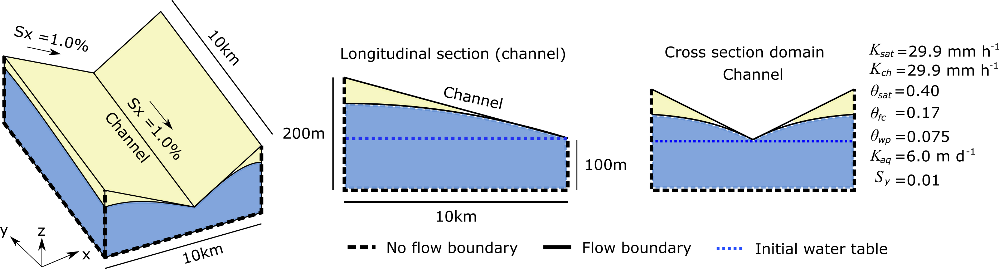
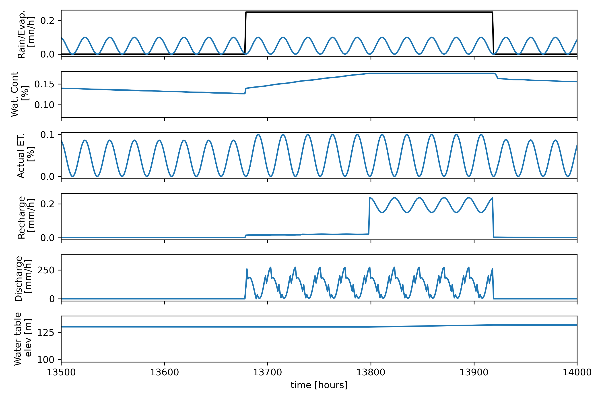

======================
DRYP Tutorial
======================

Runing the Tilted-V catchment model test
========================================

This folder contains files to run the tilted-V catchment model.

Model parameters and simulation settings
---------------------------------------------

The model requires a series of files that correspond to the parameter of the model. The parameters files have to be specified in the model input file:
input_test.dmp

The model also requires a setting file where all the model simulation parameters are specified:
setting_test.dmp

The example files are all provided in this directory for you to modify or replace, more information on the details of parameters and creating the DRYP inputs can be
:ref:`found here <dryp_parameters>`.

Running the simulation
--------------------------

Before you run the model, it is recommended to follow the steps for installation
:ref:`found here <installation_steps>` and activate the conda environments created for you in the instillation using this command:

.. code-block:: bash

    conda activate cwld 

Once all model and simulation parameters have been specified, the model can be run.

To run the test model, the test_dryp.py have to be used. This contains the path of the model input file, input_test.dmp.

If the model output matches the expected results provided in the /output_test/ folder, the test will result in no assertion errors.

The test can can also be run from the python command line or a python file with the following code:

.. code-block:: python

    from cuwalid.dryp.main_DRYP import run_DRYP

    run_DRYP("test_input/input_test.json")

The location of all file locations must be relative to the location you run the file from. This example has the input in a directory called 'test_input' in the main directory

Model outputs
-------------

The model outputs from the test function should be similar to the figure below:

The figure shows the main hydrological fluxes obtained as a result of the precipitation and potential evapotranspiration used as a forcing dataset.

Model results show how average fluxes over the catchment vary in relation to the precipitation (first panel, backline). It is expected that precipitation increases the water content of the soil, but due to evapotranspiration losses, the amount of water available in the soil will be reduced at rates proportional to the available water content.

Rates of actual evapotranspiration vary depending on the availability of water, if there is enough water in the soil, water will be lost at potential rates (first panel blue line). if there is no water available the rate will be zero.

If the soil storage capacity of the soil is reached, water will percolate to the groundwater reservoir and produce recharge (fourth panel), this will in turn increase the water table elevation (bottom panel).

Running a regional model
========================

DRYP was designed to perform hydrological simulations at large or hyper resolution hydrological models, so a version a regional scale model
for the Horn of Africa Dryland region has been developed. This model is still on going further development, however, a first version of this
model is availble at .

Running the large scale model may need additional computation resources to speed up the running process. This model has been set up for HPC server, however,
a short version of the model can be prepared and executed using the DRYP pre-processing tools, assuming that all parameters maps are provided.

Pre-processing dataset
======================

To calculate the constributed areas (watersheds) at location specified in the outputs point files, the following the following code can be used:

.. parsed-literal::

	>>> from cuwalid.dryp.components.DRYP_watershed import get_area_watershed
	>>> filename = "test_input.txt"
	>>> get_area_watershed(filename)

To find the extend of the contributing area for a specific location the following code can be used:

.. parsed-literal::

	>>> outlet = np.zeros_like(dem, dtype=int)
	>>> outlet[ipoint] = 1

	>>> ibasin = watershed(dem, outlet, nrows, ncols, flowDir=flowDir, cellsize=cellsize)
	>>> ibasin = np.flip(ibasin.reshape(nrows, ncols), 0)
	>>> data, profile, transform = open_raster(fname)
	>>> fname_basin = "basin.asc"
	>>> save_raster(fname_basin, ibasin, profile, transform)

Generate soil parameters files required for DRYP.

Creating a hydrological model from regional datasets
====================================================

Prepraring DRYP code
---------------------

.. toctree::
   :maxdepth: 2
   :caption: Contents:

Preprocessing datasets
-----------------------

.. toctree::
   :maxdepth: 2
   :caption: Contents:

Runing DRYP
------------

.. toctree::
   :maxdepth: 2
   :caption: Contents:

Postprocessing podel outputs
-----------------------------

.. toctree::
   :maxdepth: 2
   :caption: Contents:

Quick mass balance calculation
-------------------------------
.. toctree::
   :maxdepth: 2
   :caption: Contents:

   notebooks/DRYP_water_balance