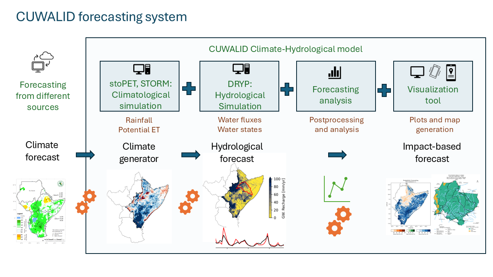

Introduction
============

`CUWALID <https://down2earthproject.org/assets/files/CUWALID_Model.pdf>`_ (Climate into Useful Water And Land Information in Drylands) is an open-source model to explore the impact of seasonal rainfall forecasts or future climate change projections on streamflow, soil moisture, groundwater, and vegetation

The project contains 3 models:

1. :ref:`DRYP <dryp_model>` - quantifies water partitioning and flowpaths in dryland regions
2. :ref:`STORM <storm_model>` - generates realistic rainstorms
3. :ref:`stoPET <stopet_model>` - generates patterns of evaporative demand
4. :ref:`CUWALIDCast <forecast_model>` - Hydrological and Impact based forecasting model

The models listed have been combined into one streamlined system (CUWALID), it is recommended for most users to run the system as a whole :ref:`here <cuwalid_tutorial>`. But the models can also be run independently (instructions for each model found in "Tutorials" section).

These models work together to produce outputs at monthly, seasonal, annual or decadal assessments. CUWALID is underpinned by DRYP, a calibrated regional hysdrological model for the Horn of Africa drylands (HAD) that includes key processes occuring in drylands which other models fail to capture.

