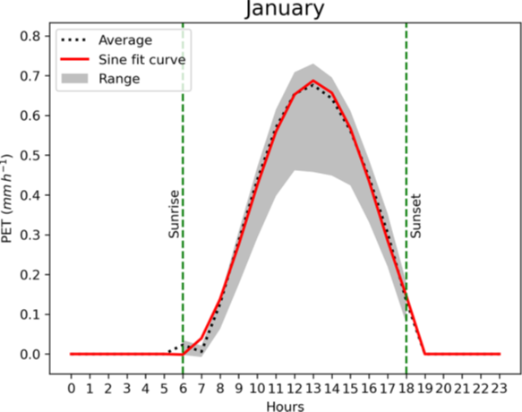
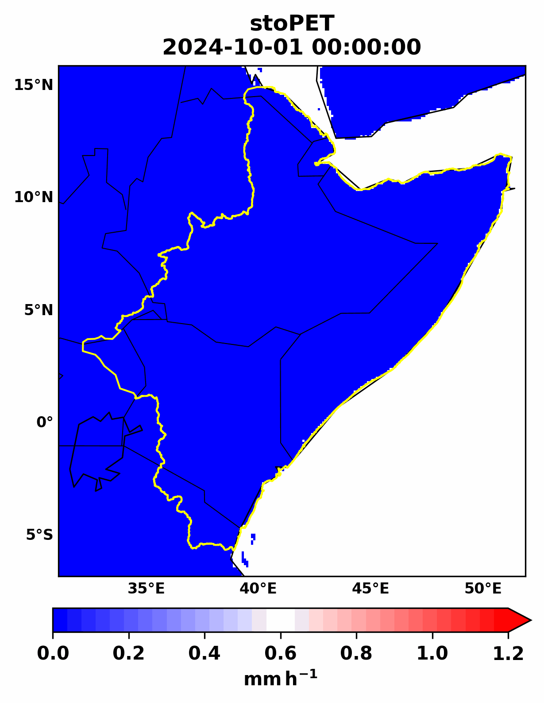

.. _stopet_model:

=========================================================
stoPET: Stochastic Potential evapotranspiration generator
=========================================================

Model description and structure
--------------------------------

stoPET is a stochastic potential evapotranspiration (PET) generator developed based on a global hourly PET dataset with a high spatial resolution (`hPET <https://doi.org/10.1038/s41597-021-01003-9>`__). `stoPET <https://doi.org/10.5194/gmd-16-557-2023>`__ is designed to simulate a realistic time series of PET that captures the diurnal and seasonal variability in hPET and supports the simulation of various climate change scenarios.

The stoPET model is based on fitting a sine function (Figure. 1 solid red line) to the average diurnal cycle calculated from hPET for each month and grid cell (Figure. 1 dotted line). The sine function, defined in Eq. (1), provides the following four parameters required to represent the characteristic of hourly PET for each month at each grid cell:

.. math::

   Y = A sin(B * t + C) + D

Where:

- **A** represents the diurnal amplitude (mm/h),
- **B** is the frequency (1/h),
- **C** is the phase shift (-), and
- **D** is the vertical shift (mm/h).
- **t** is time (h)
- **Y** is the new PET value (mm/h) generated from the sine function.

The sine fit is only done based on values for daylight hours (sunrise to sunset), and nighttime PET values are set to zero. To account for the PET variability within each month (Fig. 1 grey shade), stoPET uses a noise ratio parameter represented stochastically in the model. This noise ratio is randomly generated using parameters determined from 40 years of hPET data.

For each day of the month, the model generates these random noise ratio values and multiplies them by the average PET values generated using the sine function (Y) to get a new timeseries that is unique every time.

Figure 1 below shows an example of a sine function curve fitted over the average hourly PET values for January at Wajir (Kenya). The black dotted line is the average from hPET, and the red solid line represents the fitted sine function. The grey shaded area ranges across all January days in the 40-year record for hPET. Average sunrise and sunset times are shown in green vertical dashed lines.

